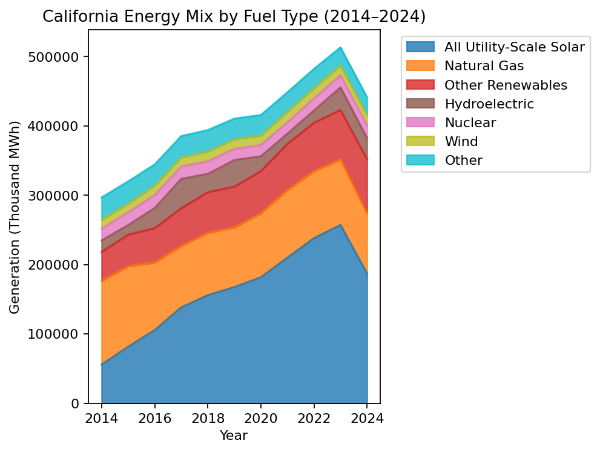

# California Energy Analysis (2014-2024)

## Overview

Fuel-based analysis of California’s electricity generation from 2014–2024. Focus: what fuels power California, how that mix changed, and the headline trends.

## Goal & Importance

This project quantifies the growth of renewables and the evolution of fossil fuel use in California’s grid. It answers what changed over the last decade and by how much, presenting a concise summary and exportable data.

## Tech & Data

Tech Stack: Python, Pandas (optional: Matplotlib, Jupyter).

Data Source: U.S. Energy Information Administration (EIA). The script reads the primary CSV in `data/` and computes totals, growth, and volatility by fuel.

## Method (short)

The script auto-detects the year header in the EIA CSV, pivots to a Year × Fuel table, calculates per-fuel totals and growth, then summarizes the period (total MWh, growth, peak year, dominant fuel).

## Findings (from the included CSV)

Total generation across 2014–2024 is 6,670,095 MWh, up 32.2% over the period. 2023 is the peak year. The aggregate “all fuels (utility-scale)” line dominates averages as expected; looking at fuels, natural gas remains the largest single contributor over the period, while solar and other renewables show the clearest multi‑year gains.



Top fuels by total output (2014–2024):

| Fuel | Total MWh | Growth % |
|---|---:|---:|
| All Utility-Scale Solar | 1,778,651 | +12.9% |
| Natural Gas | 1,064,116 | -3.3% |
| Other Renewables | 656,276 | +6.5% |

Note: The CSV also includes an aggregate “All sectors : all fuels (utility-scale)” totaling 2,220,265 MWh. It is a total, not a single fuel, and is excluded from the fuel table above.

## Run it

Install minimal packages, run the script, and use the exports.

```bash
pip install pandas numpy
python main.py
# Outputs: output/processed_data.csv, output/analysis_results.json
```

## Data source

EIA Electricity Data Browser: https://www.eia.gov/electricity/data/browser/
