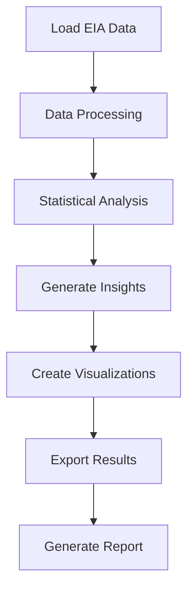

# California Energy Generation Analysis (2014-2024)

A comprehensive analysis of California's electricity generation transition, featuring interactive visualizations, statistical analysis, and actionable insights for energy policy and planning.

## Project Overview

This project analyzes California's electricity generation data from 2014-2024, tracking the evolution of the state's energy mix across different power generation categories. The analysis reveals trends in renewable energy adoption, fossil fuel dependency changes, and overall generation capacity growth.

### Key Features

- Data Analysis: Comprehensive statistical analysis of EIA electricity generation data
- Interactive Visualizations: Beautiful, interactive charts using Altair
- Actionable Insights: Detailed findings and policy implications
- Clean Architecture: Well-organized, maintainable codebase
- Automated Pipeline: One-command execution for complete analysis

## Quick Start

### Prerequisites
- Python 3.8 or higher
- pip package manager

### Installation

1. Clone the repository
   ```bash
   git clone <repository-url>
   cd california-energy-analysis
   ```

2. Install dependencies
   ```bash
   pip install -r requirements.txt
   ```

3. Run the complete analysis
   ```bash
   python main.py
   ```

4. View the results
   ```bash
   # Open interactive visualizations
   open output/stacked_area_interactive.html

   # View detailed analysis report
   open ANALYSIS_REPORT.md
   ```

### Project Structure

```
california-energy-analysis/
├── main.py                           # Main pipeline script
├── README.md                         # Complete project guide
├── ANALYSIS_REPORT.md                # Detailed analysis report
├── requirements.txt                  # Dependencies
├── .gitignore                       # Git ignore rules
├── src/                             # Core modules
│   ├── analysis.py                  # Data analysis engine
│   └── visualization.py             # Interactive visualization generator
├── data/                            # Input data
│   └── eia_california_generation_annual.csv
└── output/                          # Generated results
    ├── analysis_results.json        # Statistical analysis results
    ├── processed_data.csv           # Clean processed data
    └── *_interactive.html           # Interactive visualizations
```

## Analysis Results

### Key Findings (2014-2024)

| Metric | Value | Trend |
|--------|-------|-------|
| Total Generation | 5.3M MWh | +11.0% growth |
| Peak Year | 2023 | 529,678 MWh |
| Dominant Category | Electric Power | ~38% share |
| Fastest Growing | Non-Cogen Utilities | +26.6% |

### Category Performance

- Electric Utility Non-Cogen: Strongest growth (+26.6%)
- Independent Power Producers: Steady growth (+12.2%)
- Electric Utility Cogen: Steepest decline (-51.7%)
- Electric Power: Stable dominance (~38% share)

## Visualizations

### Interactive Charts

1. Stacked Area Chart - Energy mix evolution over time
   - Interactive percentage breakdown by category
   - Hover tooltips with detailed generation data

2. Trend Lines - Individual category trajectories
   - Year-over-year generation trends
   - Category comparison visualization

3. Summary Statistics - Total generation by category
   - Cumulative generation (2014-2024)
   - Visual category ranking

### Viewing Visualizations

All visualizations are saved as interactive HTML files in the output/ directory:

```bash
# Open main energy mix visualization
open output/stacked_area_interactive.html

# Open trend analysis
open output/trend_lines_interactive.html

# Open summary statistics
open output/summary_stats_interactive.html
```

## Advanced Usage

### Command Line Options

```bash
# Run analysis only (skip visualizations)
python main.py --skip-viz

# Use custom data file
python main.py --data-path path/to/custom_data.csv

# Get help
python main.py --help
```

### Module Usage

```python
# Import analysis modules
from src.analysis import CaliforniaEnergyAnalyzer
from src.visualization import CaliforniaEnergyVisualizer

# Run custom analysis
analyzer = CaliforniaEnergyAnalyzer()
analyzer.load_data()
analyzer.process_data()
results = analyzer.generate_insights()

# Generate custom visualizations
visualizer = CaliforniaEnergyVisualizer()
visualizer.generate_all_visualizations()
```

## Output Files

### Analysis Results
- output/analysis_results.json: Complete statistical analysis with trends and insights
- output/processed_data.csv: Clean, processed dataset ready for further analysis

### Visualizations
- output/stacked_area_interactive.html: Main energy mix visualization
- output/trend_lines_interactive.html: Category trend analysis
- output/summary_stats_interactive.html: Summary statistics dashboard

## Development

### Adding New Analysis

1. Extend Analysis Module: Add new methods to src/analysis.py
2. Create Visualizations: Add chart functions to src/visualization.py
3. Update Pipeline: Modify main.py to include new analysis steps
4. Test Changes: Run the pipeline and verify outputs

### Code Quality Standards

- Type Hints: All functions include type annotations
- Documentation: Comprehensive docstrings for all classes and methods
- Error Handling: Robust error handling with informative messages
- Clean Code: Follow PEP 8 style guidelines

### Data Sources

- U.S. Energy Information Administration (EIA): Primary data source
- Dataset: Annual electricity net generation by utility-scale fuel type for California
- Specific Query: "Net generation for California" - All fuels (utility-scale)
- Access: https://www.eia.gov/electricity/data/browser/

## Contributing

### Getting Started
1. Fork the repository
2. Create a feature branch
3. Make your changes
4. Add tests if applicable
5. Submit a pull request

### Contribution Guidelines
- Follow existing code style and structure
- Add type hints for new functions
- Include comprehensive docstrings
- Update documentation for new features
- Ensure all tests pass

## Requirements

### Core Dependencies
```
pandas>=1.5.0          # Data manipulation
altair>=5.0.0          # Interactive visualizations
matplotlib>=3.5.0      # Static plotting support
numpy>=1.21.0          # Numerical computations
```

### Optional Dependencies
```
jupyter>=1.0.0         # Notebook support
pytest>=7.0.0          # Testing framework
```

## Pipeline Workflow



## Recent Updates

- October 2025: Complete project restructure with modular architecture
- Interactive Visualizations: Added Altair-based interactive charts
- Enhanced Analysis: Improved statistical analysis and insights generation
- GitHub Ready: Clean, well-documented codebase for open source

## Support

For questions, issues, or contributions:

- Issues: Use GitHub Issues for bug reports and feature requests
- Discussions: Use GitHub Discussions for questions and ideas
- Email: Contact project maintainers for direct inquiries

## License

This project is released under the MIT License. The EIA data is publicly available and used for educational and research purposes.

---

Project Status: Complete and Active
Last Updated: October 2025
Data Coverage: 2014-2024 (11 years, 55 data points)
